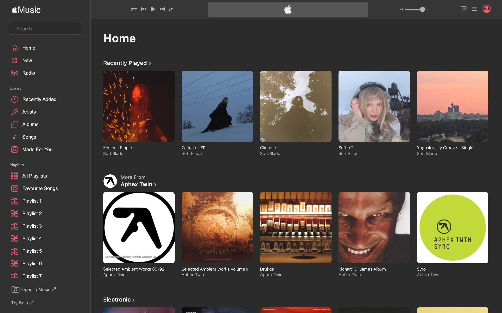

## Apple Music (Web Player)

Веб-копия Apple Music для браузера

Посмотреть проект: [https://vialvasileva.github.io/apple-music-web-player/](https://vialvasileva.github.io/apple-music-web-player/)

### Технологии

- **JavaScript / React**
- **CSS Modules** для стилизации компонентов
- **Context API** для глобального состояния
- **iTunes API** для получения данных о музыке
- **Yarn** для управления зависимостями
- **Кастомный шрифт** для уникального дизайна